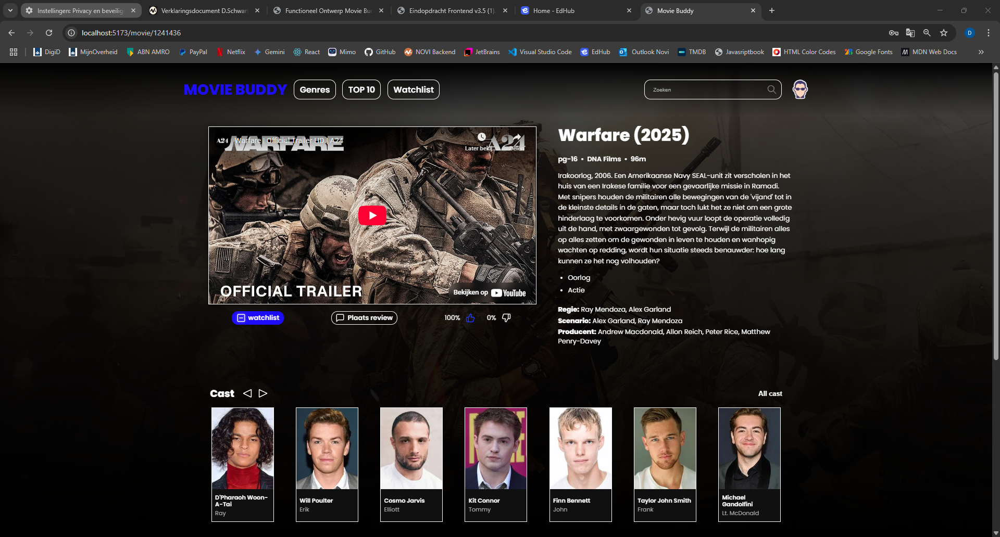

# 🎬 Movie Buddy - Installatiehandleiding

## 📌 Inleiding
Welkom bij **Movie Buddy**, de ultieme webapplicatie voor filmliefhebbers! 🎬
Met Movie Buddy kun je:
- Films zoeken en ontdekken via **The Movie Database (TMDb)** API.
- Een **persoonlijke watchlist** bijhouden.
- Beoordelingen geven aan films met een **like/dislike-systeem**.
- Een **review schrijven** voor elke film in de database.
- Inloggen en registreren via de **NOVI-backend**.

---

## 🖼️ Film Detail Pagina uit Movie Buddy


---

## 🚀 Projectoverzicht

Deze applicatie is ontwikkeld als eindopdracht voor de front-end opleiding van NOVI Hogeschool. De focus ligt op:
- een schaalbare React-applicatie
- gebruik van context, routing en component hergebruik
- gebruikersinteractie via likes, reviews en een watchlist
- realistische en testbare use cases

---

## 🧰 Gebruikte technieken

- ⚛️ **React**
- 📦 **Axios** voor API-requests (TMDB)
- 🧭 **React Router**
- 🧠 **Context API** voor auth, watchlist, likes & reviews
- 🗂 **CSS Modules** voor styling
- 🔐 **LocalStorage** voor gebruikersdata en sessie behoud
- 📐 **Figma** voor UI/UX-ontwerp
- 🖼️ **TMDB API** voor filminformatie

---

## 🛠️ Benodigdheden

Deze applicatie is bedoeld om lokaal te draaien op je eigen computer.
Je hebt hiervoor een zogeheten IDE (ontwikkelomgeving) nodig. Bekende voorbeelden zijn::

- [WebStorm (JetBrains)](https://www.jetbrains.com/webstorm/)
- [Visual Studio Code (VS Code)](https://code.visualstudio.com/)

Vervolgens zorg je ervoor dat je de volgende software hebt geïnstalleerd:

- **Git** - [Download hier](https://git-scm.com/)
- **Node.js** (v16 of hoger) - [Download hier](https://nodejs.org/)
- **NPM** (meegeleverd met Node.js)

Daarnaast heb je een **API Key** nodig van [TMDb](https://www.themoviedb.org/) om filmgegevens op te halen.
Voor de examinatoren van NOVI Hogeschool wordt de **API Key** beschikbaar gesteld middels een apart document.

---

## 🔧 Installatie-instructies

1. **Clone de repository:**

```bash
git clone <repo-url>
```

2. **Navigeer naar de projectmap:**

```bash
cd movie-buddy
```

3. **Installeer dependencies:**

```bash
npm install
```

4. **Maak een `.env` bestand aan in de root:**

```env
VITE_API_KEY=YOUR_TMDB_API_KEY
VITE_NOVI_API_URL=https://frontend-educational-backend.herokuapp.com
```

5. **Start de app:**

```bash
npm run dev
```

De app is nu bereikbaar op [http://localhost:5173](http://localhost:5173)

## 🎯 Conclusie
Gefeliciteerd! 🎉 Je hebt **Movie Buddy** succesvol geïnstalleerd en draaiende.

---

## 📜 Beschikbare npm-commando's

| Commando       | Beschrijving |
|---------------|-------------|
| `npm run dev` | Start de ontwikkelserver op `http://localhost:5173/` |
| `npm run build` | Maakt een productie-build van de applicatie |
| `npm run preview` | Bekijkt de productie-build lokaal |
| `npm install` | Installeert alle benodigde dependencies |

---

## 👥 Gebruikersrollen & Functionaliteiten

### 🔹 Gebruiker
- Registreren / Inloggen
- Films zoeken & filteren
- Films liken/disliken
- Watchlist beheren
- Reviews plaatsen
- Avatar kiezen

### 🔸 Admin
- Alle gebruikersfunctionaliteiten
- Extra toegang tot admin-pagina

---

## 🔐 Admin inloggegevens

Aangezien de beperkte back-end capaciteit, zijn de adminrechten gekoppeld aan een specifiek e-mailadres:

**Admin gebruiker:**
- **E-mailadres:** `adminbuddy@moviebuddy.nl`
- **Wachtwoord:** `AdminTest@1234`

Gebruik dit account om toegang te krijgen tot de admin functionaliteiten.

---

## ✅ NOVI-eindopdracht vereisten

| Onderdeel                         | Status |
|----------------------------------|--------|
| 4 use cases geïmplementeerd     | ✅     |
| Minimaal 50 eisen beschreven    | ✅     |
| Gebruik externe API             | ✅     |
| CRUD-acties aanwezig            | ✅     |
| Wireframes + schermontwerpen    | ✅     |
| Documentatie en testen          | ✅     |
| Sessiebeheer + gebruikerscontext | ✅     |

---

## 📚 Verantwoordingsdocument & bronnen

- [Functioneel ontwerp PDF](./Functioneel%20Ontwerp%20Movie%20Buddy.pdf)
- [Figma-ontwerpen](https://www.figma.com/)
- [TMDB API](https://www.themoviedb.org/documentation/api)

---

🎓 *Deze app is ontwikkeld als onderdeel van de front-end opleiding aan NOVI Hogeschool.*